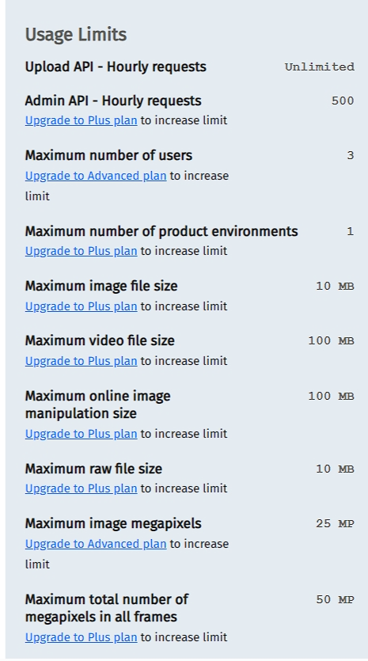

# Yudemy (Udemy Clone)

This Android Kotlin project adopts the MVVM architectural pattern, as outlined in [this guide](https://medium.com/@jecky999/mvvm-architecture-in-android-using-kotlin-a-practical-guide-73f8de1d9c58). **<--- Please read the guide**. It utilizes Firebase as the primary data storage solution and Cloudinary for media storage purposes.

## Features

## Folder and file information

1. Splash screen was added as the main activity
2. Whenever you create a new activity, in `AndroidManifest.xml`:
   - Remember to set `android:screenOrientation="portrait"` if the screen orientation is portrait only.
   - If the screen is supposed to have no action bar and no status bar, use `android:theme="@style/Theme.Yudemy.NoActionBar`
3. `dimens.xml`: store sizes. E.g: margin, padding, text size
4. `assets` folder: stores custom fonts
5. `setupActionBar()`: function to show back arrow and allow navigating to the previous activity on back button press. See example in `SignUpWithEmailActivity.kt`. How it appears:
   
6. `BaseActivity.kt`: Other activities can inherit this instead of AppCompatActivity to use functionalities such as loading dialog, show error snackbar and get the current user ID.
   Example error snackbar with message "Please enter a name"

   

7. **View binding** is enabled, allowing you to access view components easily: https://developer.android.com/topic/libraries/view-binding

8. `Constants.kt`: used to avoid Magic Numbers/Strings. Please check out this file.

9. `ViewModel` class: Responsible for managing UI-related data and business logic. It interacts with the Model and exposes data to the View. It should contain LiveData objects or observable properties to hold the data and state. I've only added example for LiveData objects in `UserViewModel` so check out this file yourself.

   E.g: `UserViewModel` stores userRepository so it doesn't interact directly with the data source. -> data abstraction. `_userData` is mutable and we can update it while `userData` is immutable so the view observe `userData`. Any changes to `_userData` will update `userData`. See example on how the View observes `userData` [here](https://medium.com/@jecky999/mvvm-architecture-in-android-using-kotlin-a-practical-guide-73f8de1d9c58) (section 4)

10. `Repository` class: Handles data operations (such as fetching data from a database, network, or other sources). It abstracts the data source details from the ViewModel.

11. Every data class, there is always an `id` field. This can help with quicker id retrieval. It is especially useful for `User` data class.

## How to add project keys

1. Store keys in `gradle.properties`. i.g: EXAMPLE_KEY = "xyz"
2. Add those before buildTypes:

```
buildFeatures {
    buildConfig = true
}
```

3. Go to `build.gradle` (app) and add fields:

```kt
buildTypes.each {
    it.buildConfigField 'String', 'API_KEY', API_KEY
    it.buildConfigField 'String', 'API_SECRET', API_SECRET
    it.buildConfigField 'String', 'CLOUD_NAME', CLOUD_NAME
    it.buildConfigField 'String', 'UPLOAD_PRESET', UPLOAD_PRESET
    it.buildConfigField 'String', 'EXAMPLE_KEY', EXAMPLE_KEY  # add here like this example
}
```

Now you can access your key by calling `BuildConfig.EXAMPLE_KEY`

## How to create image picker (to allow selecting image type only)

```kt
 // Launch image picker
ImagePicker.with(this)
    .compress(1024)         //Final image size will be less than 1 MB(Optional)
    .maxResultSize(1080, 1080)  //Final image resolution will be less than 1080 x 1080(Optional)
    .createIntent { intent ->
        // launch the image picker activity (implicit intent)
        startForProfileImageResult.launch(intent)
    }


private val startForProfileImageResult =
    registerForActivityResult(ActivityResultContracts.StartActivityForResult()) { result: ActivityResult ->
        val resultCode = result.resultCode
        val data = result.data

        if (resultCode == Activity.RESULT_OK) {
            val fileUri = data?.data!!
            val filePath: String = fileUri.path!!

            // Handle file selected. filepath is at /storage/emulated/0/Android/data/com.deadlineshooters.yudemy/files/DCIM/IMG_20240225_093432622.png
            Log.d("ImagePicker", filePath)  // Print the path of the file selected saved in local storage
            uploadToCloudinary(filePath) // upload the file path to cloudinary. This function will be defined below
        } else if (resultCode == ImagePicker.RESULT_ERROR) {
            Toast.makeText(this, ImagePicker.getError(data), Toast.LENGTH_SHORT).show()
        } else {
            Toast.makeText(this, "Task Cancelled", Toast.LENGTH_SHORT).show()
        }
    }
```

## How to upload image file to Cloudinary

1. Initialize cloudinary

```kt
//Create global variable
var config: HashMap<String, String> = HashMap()

// Initialize cloudinary. Put in onCreate() function
config["cloud_name"] = BuildConfig.CLOUD_NAME;
MediaManager.init(this, config)
```

2. Create this function:

- Simple upload to cloudinary function

```kt
/** Returns an Image object*/
 fun uploadToCloudinary(filepath: String) : Image {
        Log.d("cloudinary", BuildConfig.UPLOAD_PRESET)
        var result: Image = Image()

        MediaManager.get().upload(filepath).unsigned(BuildConfig.UPLOAD_PRESET).option("folder", Constants.CLOUDINARY_FOLDER)
            .callback(object : UploadCallback {
                override fun onSuccess(requestId: String?, resultData: MutableMap<Any?, Any?>?) {
                    Log.d("cloudinary", "Task successful\n$resultData")
                    Toast.makeText(applicationContext, "Task successful", Toast.LENGTH_LONG).show()
                    result = Image(resultData?.get("secure_url").toString(), resultData?.get("public_id").toString())
                }

                override fun onProgress(requestId: String?, bytes: Long, totalBytes: Long) {
                    val progress = bytes.toDouble() / totalBytes

                }

                override fun onReschedule(requestId: String?, error: ErrorInfo?) {
                    Log.d("cloudinary", "Task rescheduled")

                }

                override fun onError(requestId: String?, error: ErrorInfo?) {
                    Log.d("cloudinary", "Task Not successful: $error")
                    Toast.makeText(
                        applicationContext,
                        "Task Not successful$error",
                        Toast.LENGTH_LONG
                    )
                        .show()
                    if (error != null) {
                        Log.e(
                            "t",
                            "Upload failed. Error description: ${error.description}, Code: ${error.code}"
                        )
                    } else {
                        Log.e("t", "Upload failed with unknown error")
                    }
                }

                override fun onStart(requestId: String?) {
                    Log.d("cloudinary", "Start")

                    Toast.makeText(applicationContext, "Start", Toast.LENGTH_LONG).show()
                }
            }).dispatch()

        return result
    }

```

- metadata upload to cloudinary:

```kt
 fun uploadMedia(filepath: String, isVideo: Boolean = false) : Media {
        Log.d("cloudinary", BuildConfig.UPLOAD_PRESET)
        val cloudinary = Cloudinary(
            ObjectUtils.asMap(
            "cloud_name", BuildConfig.CLOUD_NAME,
            "api_key", BuildConfig.API_KEY,
            "api_secret", BuildConfig.API_SECRET))


        var result: Media = if (isVideo) Video() else Image()

        MediaManager.get().upload(filepath).option("resource_type", if (isVideo) "video" else "image").unsigned(BuildConfig.UPLOAD_PRESET).option("folder", Constants.CLOUDINARY_FOLDER)
            .callback(object : UploadCallback {
                override fun onSuccess(requestId: String?, resultData: MutableMap<Any?, Any?>?) {
                    Log.d("cloudinary", "Uploaded media successfully\n$resultData")
                    result = if (isVideo) {
                        val videoMetadata = cloudinary.api().resource(resultData?.get("public_id").toString(),
                            ObjectUtils.asMap("resource_type", "video"))

                        Log.d("cloudinary", "%% Video metadata:\n$videoMetadata")
                        val videoDuration = videoMetadata["video_duration"]
                        Video(resultData?.get("secure_url").toString(), resultData?.get("public_id").toString(), resultData?.get("resource_type").toString(), videoDuration!! as Number)
                    } else {
                        Image(resultData?.get("secure_url").toString(), resultData?.get("public_id").toString())
                    }
                }

                override fun onProgress(requestId: String?, bytes: Long, totalBytes: Long) {
                    val progress = bytes.toDouble() / totalBytes

                }

                override fun onReschedule(requestId: String?, error: ErrorInfo?) {
                    Log.d("cloudinary", "Task rescheduled")

                }

                override fun onError(requestId: String?, error: ErrorInfo?) {
                    Log.d("cloudinary", "Task Not successful: $error")

                    if (error != null) {
                        Log.e(
                            "t",
                            "Upload failed. Error description: ${error.description}, Code: ${error.code}"
                        )
                    } else {
                        Log.e("t", "Upload failed with unknown error")
                    }
                }

                override fun onStart(requestId: String?) {
                    Log.d("cloudinary", "Start")
                }
            }).dispatch()

        return result
    }
```

<u>Note</u>:

- You can now extract `resultData` to save in Firebase field.
- Here is Cloudinary usage limit:
  

- resultData for video upload:

```json
{
  "signature": "f0b98e1cd0558257ac632b207be712f099c9fcd4",
  "created_at": "2024-02-25T03:26:16Z",
  "asset_id": "47fb271220b8425fa1fb5e93fe253162",
  "video": {
    "codec": "h264",
    "bit_rate": 2940613,
    "dar": "16:9",
    "time_base": "1/15360",
    "level": 31,
    "pix_format": "yuv420p",
    "profile": "Main"
  },
  "type": "upload",
  "public_id": "Yudemy/hnm7xosx84guwxftnowt",
  "duration": 57.863991,
  "bit_rate": 3071827,
  "pages": 0,
  "original_filename": "2 - Thanks",
  "placeholder": false,
  "playback_url": "https://res.cloudinary.com/dbgaeu07x/video/upload/sp_auto/v1708831576/Yudemy/hnm7xosx84guwxftnowt.m3u8",
  "audio": {
    "codec": "aac",
    "bit_rate": 128005,
    "channels": 2,
    "channel_layout": "stereo",
    "frequency": 44100
  },
  "nb_frames": 1734,
  "height": 720,
  "rotation": 0,
  "format": "mp4",
  "resource_type": "video",
  "secure_url": "https://res.cloudinary.com/dbgaeu07x/video/upload/v1708831576/Yudemy/hnm7xosx84guwxftnowt.mp4",
  "version_id": "17ff892f0b0706279b754d5aa2510f98",
  "version": 1708831576,
  "access_mode": "public",
  "frame_rate": 30.0,
  "done": true,
  "url": "http://res.cloudinary.com/dbgaeu07x/video/upload/v1708831576/Yudemy/hnm7xosx84guwxftnowt.mp4",
  "tags": [],
  "folder": "Yudemy",
  "is_audio": false,
  "bytes": 22236574,
  "width": 1280,
  "etag": "41814aaf88e051cb4c9102cfdd705d17"
}
```

- resultData for image upload:

```json
{
  "signature": "86cc118b7b6443304d31ec7bce1af2ed20ca7590",
  "format": "jpg",
  "resource_type": "image",
  "secure_url": "https://res.cloudinary.com/dbgaeu07x/image/upload/v1708831569/Yudemy/p2osavusxr40mqaufh4i.jpg",
  "created_at": "2024-02-25T03:26:09Z",
  "asset_id": "cbf7e889ce28c199f101f97825b52254",
  "version_id": "1e33dc16299698a421bfe719c4ce9236",
  "type": "upload",
  "version": 1708831569,
  "access_mode": "public",
  "url": "http://res.cloudinary.com/dbgaeu07x/image/upload/v1708831569/Yudemy/p2osavusxr40mqaufh4i.jpg",
  "public_id": "Yudemy/p2osavusxr40mqaufh4i",
  "tags": [],
  "folder": "Yudemy",
  "original_filename": "4095020_b65f_4",
  "bytes": 52079,
  "width": 750,
  "etag": "1b8aea5244bac7f1245062cb0fd1714b",
  "placeholder": false,
  "height": 422
}
```

## How to add a new document to a collection in Firestore database

- Import these:

```kt
import com.google.firebase.firestore.ktx.firestore
import com.google.firebase.ktx.Firebase
```

```kt
// put as global variable
val db = Firebase.firestore

// inside onCreate function or any other function
val exampleDocument = mutableMapOf<String, Any>()

exampleDocument["first_name"] = "John"
exampleDocument["last_name"] = "Doe"
exampleDocument["headline"] = "Software Developer"
exampleDocument["bio"] = "Lorem ipsum dolor sit amet, consectetur adipiscing elit."
exampleDocument["image"] = "https://example.com/image.jpg"
```

**BONUS**: Add an image field for Cloudinary:

```kt
val imageMap = HashMap<String, String>()
imageMap["secure_url"] = "https://res.cloudinary.com/dbgaeu07x/image/upload/v1706887098/rxesnsadmgpmtiylqh2y.png"
imageMap["public_id"] = "rxesnsadmgpmtiylqh2y"
exampleDocument["image"] = imageMap
```

Now upload to Firestore:

```kt
 db.collection("example_collection")
    .add(exampleDocument)
    .addOnSuccessListener { documentReference ->
        Log.d("firebase", "DocumentSnapshot written with ID: ${documentReference.id}")
    }
    .addOnFailureListener { e ->
        Log.w("firebase", "Error adding document", e)
    }
```

<u>**Note**</u>: you can see the logs for firebase by searching for `firebase` in logcat.

## How to add metadata to Android

1. Locate the Android directory: Go to [device explorer](https://stackoverflow.com/questions/4847654/how-to-access-local-files-of-the-filesystem-in-the-android-emulator) and go to `/storage/emulated/0/Android/data/com.deadlineshooters.yudemy/files/DCIM` folder
2. Drag any meta data inside the DCIM folder

## Local Quickstart

Follow these steps to get the app running locally.

### 1. Clone the repo

```
git clone https://github.com/DeadlineShooters/Yudemy-Mobile.git
```

### 2. Add the key section in `gradle.properties`

Go to the end of the file and add:

### 3. Put file `google-services.json` into folder `app`

### 4. Put gradle.properties into project folder

## Set up your own Firebase

1. Create a new project in Firebase
2. Go to project settings
3. Add Firebase to your Android app (follow Firebase instructions)
4. Add this line to plugins block in `build.gradle (app level)`:
   `id 'com.google.gms.google-services'`
5. Search `Firebase` in logcat. If found `FirebaseApp initialization successful` message, you are all set!
