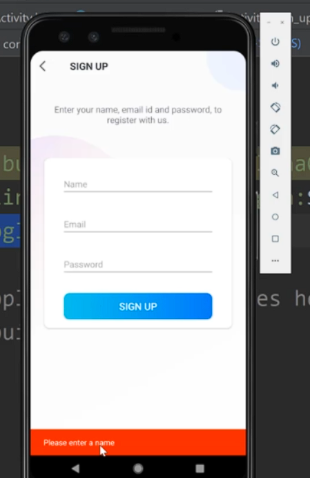

# Yudemy (Udemy Clone)

This Android Kotlin project adopts the MVVM architectural pattern, as outlined in [this guide](https://medium.com/@jecky999/mvvm-architecture-in-android-using-kotlin-a-practical-guide-73f8de1d9c58). It utilizes Firebase as the primary data storage solution and Cloudinary for media storage purposes.

## Features

## Folder and file information

1. Splash screen was added as the main activity
2. Whenever you create a new activity, in `AndroidManifest.xml`:
   - Remember to set `android:screenOrientation="portrait"` if the screen orientation is portrait only.
   - If the screen is supposed to have no action bar and no status bar, use `android:theme="@style/Theme.Yudemy.NoActionBar`
3. `dimens.xml`: store sizes. E.g: margin, padding, text size
4. `assets` folder: stores custom fonts
5. `setupActionBar()`: function to show back arrow and allow navigating to the previous activity on back button press. See example in `SignUpWithEmailActivity.kt`. How it appears:
   
6. `BaseActivity.kt`: Other activities can inherit this instead of AppCompatActivity to use functionalities such as loading dialog, show error snackbar and get the current user ID.
   Example error snackbar with message "Please enter a name"

   

7. **View binding** is enabled, allowing you to access view components easily: https://developer.android.com/topic/libraries/view-binding

8.`Constants.kt`: used to avoid Magic Numbers/Strings. Please check out this file.

9. `viewmodels` folder: stores view models to handle interactions with the Firestore database. It fetches tweets in real-time and also incorporates business logic.

10. Every data class, there is always an `id` field. This can help with quicker id retrieval. It is especially useful for `User` data class.

## How to add project keys

1. Store keys in `gradle.properties`. i.g: EXAMPLE_KEY = "xyz"
2. Add those before buildTypes:

```
buildFeatures {
    buildConfig = true
}
```

3. Go to `build.gradle` (app) and add fields:

```kt
buildTypes.each {
    it.buildConfigField 'String', 'API_KEY', API_KEY
    it.buildConfigField 'String', 'API_SECRET', API_SECRET
    it.buildConfigField 'String', 'CLOUD_NAME', CLOUD_NAME
    it.buildConfigField 'String', 'UPLOAD_PRESET', UPLOAD_PRESET
    it.buildConfigField 'String', 'EXAMPLE_KEY', EXAMPLE_KEY  # add here like this example
}
```

Now you can access your key by calling `BuildConfig.EXAMPLE_KEY`

## How to create image picker (to allow selecting image type only)

```kt
 // Launch image picker
ImagePicker.with(this)
    .compress(1024)         //Final image size will be less than 1 MB(Optional)
    .maxResultSize(1080, 1080)  //Final image resolution will be less than 1080 x 1080(Optional)
    .createIntent { intent ->
        // launch the image picker activity (implicit intent)
        startForProfileImageResult.launch(intent)
    }


private val startForProfileImageResult =
    registerForActivityResult(ActivityResultContracts.StartActivityForResult()) { result: ActivityResult ->
        val resultCode = result.resultCode
        val data = result.data

        if (resultCode == Activity.RESULT_OK) {
            val fileUri = data?.data!!
            val filePath: String = fileUri.path!!

            // Handle file selected
            Log.d("ImagePicker", filePath)  // Print the path of the file selected saved in local storage
            uploadToCloudinary(filePath) // upload the file path to cloudinary. This function will be defined below
        } else if (resultCode == ImagePicker.RESULT_ERROR) {
            Toast.makeText(this, ImagePicker.getError(data), Toast.LENGTH_SHORT).show()
        } else {
            Toast.makeText(this, "Task Cancelled", Toast.LENGTH_SHORT).show()
        }
    }
```

## How to upload image file to Cloudinary

1. Initialize cloudinary

```kt
//Create global variable
var config: HashMap<String, String> = HashMap()

// Initialize cloudinary. Put in onCreate() function
config["cloud_name"] = BuildConfig.CLOUD_NAME;
MediaManager.init(this, config)
```

2. Create this function:

```kt
private fun uploadToCloudinary(filepath: String) {
    Log.d("cloudinary", BuildConfig.UPLOAD_PRESET)

    MediaManager.get().upload(filepath).unsigned(BuildConfig.UPLOAD_PRESET)
        .callback(object : UploadCallback {
            override fun onSuccess(requestId: String?, resultData: MutableMap<Any?, Any?>?) {
                Log.d("cloudinary", "Task successful\n$resultData")

                Toast.makeText(applicationContext, "Task successful", Toast.LENGTH_LONG).show()
            }

            override fun onProgress(requestId: String?, bytes: Long, totalBytes: Long) {
                val progress = bytes.toDouble() / totalBytes

            }

            override fun onReschedule(requestId: String?, error: ErrorInfo?) {
                Log.d("cloudinary", "Task rescheduled")

            }

            override fun onError(requestId: String?, error: ErrorInfo?) {
                Log.d("cloudinary", "Task Not successful: $error")
                Toast.makeText(
                    applicationContext,
                    "Task Not successful$error",
                    Toast.LENGTH_LONG
                )
                    .show()
                if (error != null) {
                    Log.e(
                        "t",
                        "Upload failed. Error description: ${error.description}, Code: ${error.code}"
                    )
                } else {
                    Log.e("t", "Upload failed with unknown error")
                }
            }

            override fun onStart(requestId: String?) {
                Log.d("cloudinary", "Start")

                Toast.makeText(applicationContext, "Start", Toast.LENGTH_LONG).show()
            }
        }).dispatch()
}

```

<u>Note</u>: You can now extract `resultData` to save in Firebase field.

## How to add a new document to a collection in Firestore database

- Import these:

```kt
import com.google.firebase.firestore.ktx.firestore
import com.google.firebase.ktx.Firebase
```

```kt
// put as global variable
val db = Firebase.firestore

// inside onCreate function or any other function
val exampleDocument = mutableMapOf<String, Any>()

exampleDocument["first_name"] = "John"
exampleDocument["last_name"] = "Doe"
exampleDocument["headline"] = "Software Developer"
exampleDocument["bio"] = "Lorem ipsum dolor sit amet, consectetur adipiscing elit."
exampleDocument["image"] = "https://example.com/image.jpg"
```

**BONUS**: Add an image field for Cloudinary:

```kt
val imageMap = HashMap<String, String>()
imageMap["secure_url"] = "https://res.cloudinary.com/dbgaeu07x/image/upload/v1706887098/rxesnsadmgpmtiylqh2y.png"
imageMap["public_id"] = "rxesnsadmgpmtiylqh2y"
exampleDocument["image"] = imageMap
```

Now upload to Firestore:

```kt
 db.collection("example_collection")
    .add(exampleDocument)
    .addOnSuccessListener { documentReference ->
        Log.d("firebase", "DocumentSnapshot written with ID: ${documentReference.id}")
    }
    .addOnFailureListener { e ->
        Log.w("firebase", "Error adding document", e)
    }
```

<u>**Note**</u>: you can see the logs for firebase by searching for `firebase` in logcat.

## Local Quickstart

Follow these steps to get the app running locally.

### 1. Clone the repo

```
git clone https://github.com/DeadlineShooters/Yudemy-Mobile.git
```

### 2. Add the key section in `gradle.properties`

Go to the end of the file and add:

### 3. Put file `google-services.json` into folder `app`

## Set up your own Firebase

1. Create a new project in Firebase
2. Go to project settings
3. Add Firebase to your Android app (follow Firebase instructions)
4. Add this line to plugins block in `build.gradle (app level)`:
   `id 'com.google.gms.google-services'`
5. Search `Firebase` in logcat. If found `FirebaseApp initialization successful` message, you are all set!
